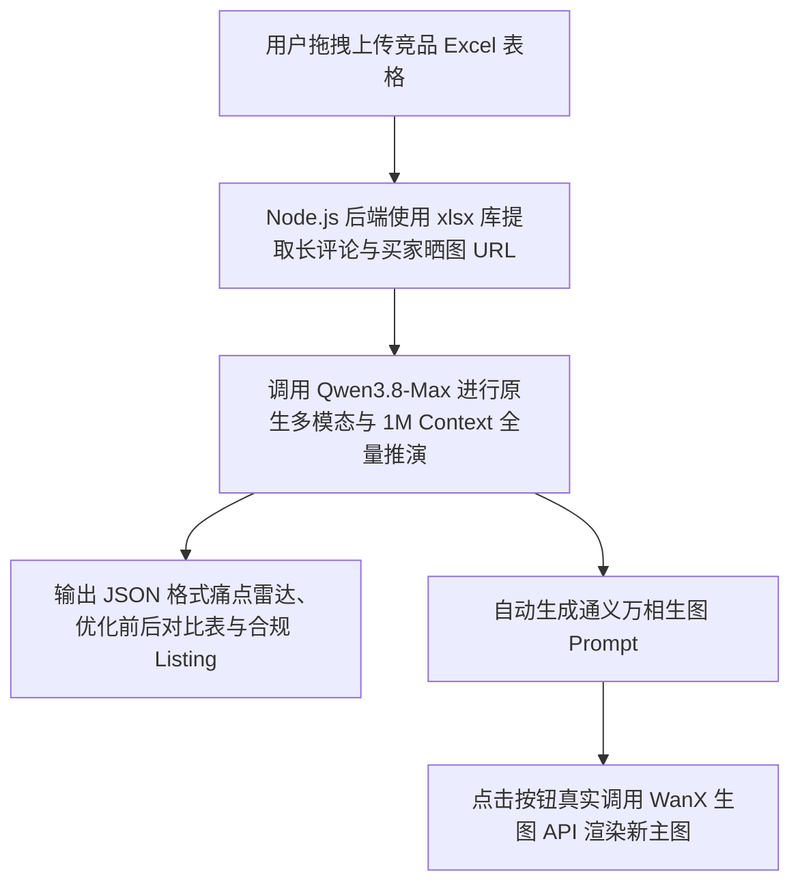

# Qwen-ECom-Agent 🚀

> **Qwen3.8-Max 电商竞品爆款全维拆解与重构 Agent**  
> *Powered by Qwen3.8-Max (1M Context Window + Native Multimodal Vision) & WanX Image Generation API. Built with QCoder.*


---

## 📌 项目简介

**Qwen-ECom-Agent** 是一款专门针对国内/跨境电商选品、改款及竞品反向工程（Reverse Engineering）打造的生产级开源 SaaS 工具。

项目充分发挥了旗舰大模型 **Qwen3.8-Max** 的两大核心硬实力：
1. **100万 Token 超长上下文 (1M Context)**：一口气吞下 1,000+ 条买家追评与长文本，全量聚类识别隐秘产品缺陷；
2. **原生多模态视觉识读 (Native Vision)**：无需第三方 OCR 工具，直接识读买家晒图中的实物色差、细节瑕疵与质检报告章印。

同时联动 **通义万相 (WanX)** 生图大模型，实现了 **“竞品诊断 ➡️ 痛点聚类 ➡️ 合规 Listing 重构 ➡️ 100% 广告法拦截 ➡️ 一键生成新主图”** 的极致闭环。

---

## ✨ 核心特性

- 📁 **真实 Excel 拖拽上传与多项目管理**：支持直接拖入从天猫/淘宝/亚马逊等平台导出的评论 Excel 表格 (`.xlsx`)。
- 👁️ **原生买家晒图四维解析**：自动提取晒图中的品质状态、真实场景、视觉信号与图文一致性。
- 🛡️ **广告法极限词 100% 自动拦截**：内置合规约束引擎，自动过滤“全网第一”、“最顶级”等敏感词，并强制校验国家标准号 (如 GB/T 32614-2016)。
- 🎨 **通义万相生图一键联动**：由 Qwen3.8-Max 自动输出生图提示词，点击按钮即可真实调用通义万相 API 渲染生成无瑕疵新主图。

---

## 🛠️ 技术架构

```
Qwen-ECom-Agent/
├── public/                 # Vue 3 响应式前端控制台
├── server.js               # Node.js + Express 服务端 (包含 Qwen3.8-Max & WanX API 调用)
├── uploads/                # 真实 Excel 上传解析目录
├── data/                   # JSON 数据持久化落盘
└── .env.example            # 环境变量配置模版
```



---

## 🚀 快速开始

### 1. 克隆项目与安装依赖
```bash
git clone https://github.com/YOUR_USERNAME/Qwen-ECom-Agent.git
cd Qwen-ECom-Agent
npm install
```

### 2. 配置环境变量
复制 `.env.example` 为 `.env` 并填入你的 DashScope API Key：
```bash
cp .env.example .env
```
在 `.env` 中修改：
```env
DASHSCOPE_API_KEY=your_dashscope_api_key_here
PORT=3000
```

### 3. 启动服务
```bash
npm start
```
打开浏览器访问：`http://localhost:3000`

---

## 📄 开源协议

本项目基于 [MIT License](LICENSE) 开源。
